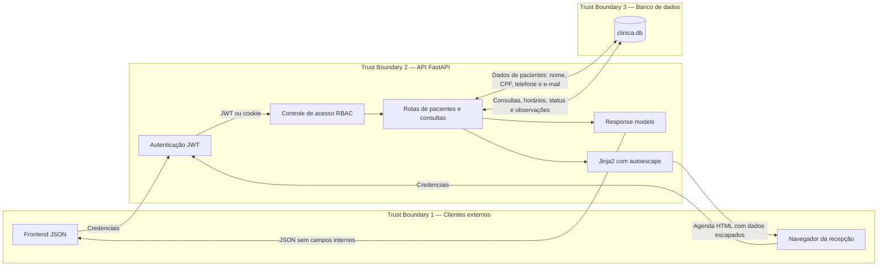

# Exercício 3 — Análise CIA e DFD

## 1. Tríade CIA

### Confidencialidade

A aplicação armazena dados sensíveis, como nome, CPF, telefone e e-mail dos
pacientes, além de informações das consultas. Esses dados devem ser acessados
somente por usuários autorizados.

Controles existentes:

- autenticação com JWT;
- senhas armazenadas com hash;
- controle de acesso por papéis;
- response model que impede a exposição de `notes` e `created_at` nas respostas
  de consultas;
- agenda protegida por autenticação;
- escape automático do Jinja2 contra XSS.

Pontos que ainda precisam de atenção:

- a chave JWT está escrita diretamente no código;
- não existe controle para limitar quais pacientes cada profissional pode ver;
- os dados do paciente são retornados integralmente pelas rotas de pacientes.

### Integridade

Os dados de pacientes e consultas não podem ser alterados por usuários sem
permissão, pois alterações incorretas podem comprometer a agenda da clínica.

Controles existentes:

- Pydantic e SQLModel validam os tipos recebidos;
- somente `admin` e `recepcionista` podem criar, alterar ou excluir consultas;
- profissionais possuem somente permissão de leitura;
- os testes verificam permissões concedidas e negadas.

Pontos que ainda precisam de atenção:

- não existe histórico de quem alterou ou excluiu uma consulta;
- o cadastro permite informar o papel do próprio usuário;

### Disponibilidade

A agenda precisa estar acessível para que a recepção e os profissionais consigam
organizar os atendimentos.

Controles existentes:

- banco criado automaticamente ao iniciar a API;
- testes automatizados usam um banco separado em memória.

Pontos que ainda precisam de atenção:

- não há rate limiting contra excesso de requisições;
- não existem monitoramento e health check.

## 2. Diagrama de Fluxo de Dados (DFD)

## 3. Trust boundaries e fluxos sensíveis

| Fronteira            | Descrição                                            | Dados sensíveis envolvidos                    |
| -------------------- | ---------------------------------------------------- | --------------------------------------------- |
| TB1 → TB2            | Clientes enviam requisições para a API               | credenciais, JWT, cookie e dados clínicos     |
| Autenticação → rotas | A identidade é validada antes do acesso              | e-mail, papel e token do usuário              |
| TB2 → TB3            | A API lê e grava no SQLite                           | CPF, contato, consultas e observações         |
| Banco → JSON         | Dados internos são transformados em resposta pública | dados da consulta, sem `notes` e `created_at` |
| Banco → HTML         | Dados persistidos são exibidos na agenda             | horário, paciente, profissional e status      |
