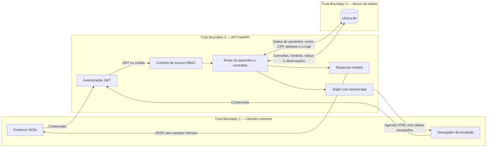

# Exercício 5 — Arquitetura de segurança e vetores de ataque

## 1. Partições do sistema

| Partição     | Componentes                                          | Responsabilidade                            |
| ------------ | ---------------------------------------------------- | ------------------------------------------- |
| Clientes     | frontend JSON, navegador da recepção                 | consumir a API e a agenda                   |
| API          | FastAPI e routers de usuários, pacientes e consultas | receber, validar e responder requisições    |
| Segurança    | autenticação JWT e RBAC                              | identificar usuários e verificar permissões |
| Apresentação | response models e templates Jinja2                   | limitar o JSON e gerar a agenda HTML        |
| Persistência | SQLModel e banco `clinica.db`                        | armazenar usuários, pacientes e consultas   |

## 2. Fluxo de dados (criado no exercício 3)

## 3. Vetores de ataque nos três eixos

### Design

| Vetor de ataque                            | Mitigação                                                                      |
| ------------------------------------------ | ------------------------------------------------------------------------------ |
| usuário escolhe `role="admin"` no cadastro | remover `role` do cadastro público e restringir a alteração de papéis a admins |
| consultas são marcadas no mesmo horário    | validar a disponibilidade do profissional antes de gravar a consulta           |

### Implementação

| Vetor de ataque           | Mitigação                                                                       |
| ------------------------- | ------------------------------------------------------------------------------- |
| XSS persistente na agenda | usar autoescape do Jinja2                                                       |
| falsificação de JWT       | validar assinatura e algoritmo, retirar a chave do código e implementar rotação |
| envio de dados inválidos  | validar tipos, conteúdo e regras de negócio com Pydantic                        |

### Infraestrutura

| Vetor de ataque                        | Mitigação                                                   |
| -------------------------------------- | ----------------------------------------------------------- |
| excesso de requisições                 | adicionar rate limiting, limites de payload e paginação     |
| leitura ou alteração do arquivo SQLite | restringir permissões do arquivo e usar criptografia        |
| perda ou corrupção do banco            | criar backups periódicos e testar o processo de restauração |
| indisponibilidade                      | adicionar monitoramento, health check e redundância         |
